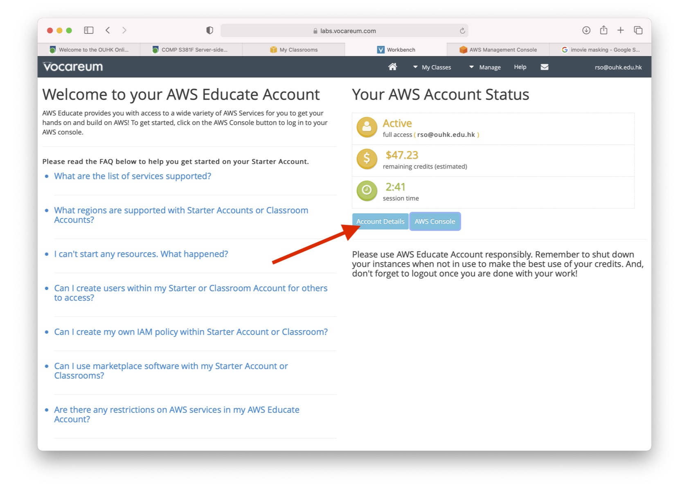
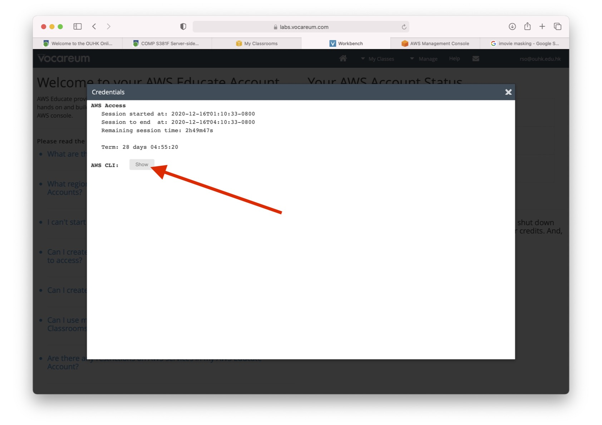
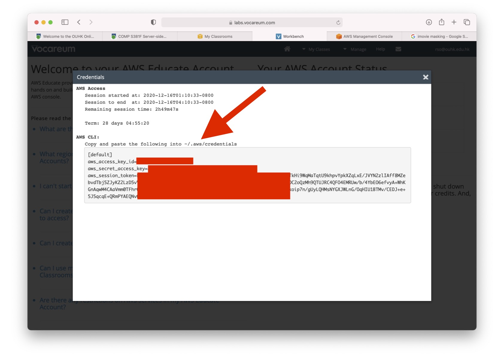

# Claudia.js Examples
This project contains examples of using [Claudia.js](https://claudiajs.com) to build **serverless** RESTful functions, which will be deployed using  [AWS Lambda](https://aws.amazon.com/lambda/) + [AWS API Gateway](https://aws.amazon.com/api-gateway/)

1. `gender` - RESTful API to determine gender of some first names.
1. `shape` - RESTful APIs for calculating perimeter and area of circles and squares.
1. `booking` - Deploy Express app using [Claudia's Lambda proxy wrapper](https://claudiajs.com/tutorials/serverless-express.html)
1. `toRomanNumeral` - Deploy Express app using [Claudia's Lambda proxy wrapper](https://claudiajs.com/tutorials/serverless-express.html)

## [Preparation](#preparation)
You need to create a `~/.aws/credentials` file that contains your **AWS Access Key ID**, **AWS Secret Access Key** and **AWS Session Token**.

1. Obtain your **AWS Access Key ID**, **AWS Secret Access Key** and **AWS Session Token**.  See instructions below.





2. Add these keys to your `~/.aws/credentials` file.
```
[claudia]
aws_access_key_id = YOUR_ACCESS_KEY
aws_secret_access_key = YOUR_ACCESS_SECRET
aws_session_token = YOUR_SESSION_TOKEN
```
3. Change the access rights of `~/.aws/credentials`
```
chmod 600 ~/.aws/credentials
```
4. Set the `AWS_PORFILE` environment variable to `claudia`
```
export AWS_PROFILE=claudia
```
5. Install Claudia
```
npm install claudia -D
```
Refer to the [official preparation guide](https://claudiajs.com/tutorials/installing.html) for more details.
