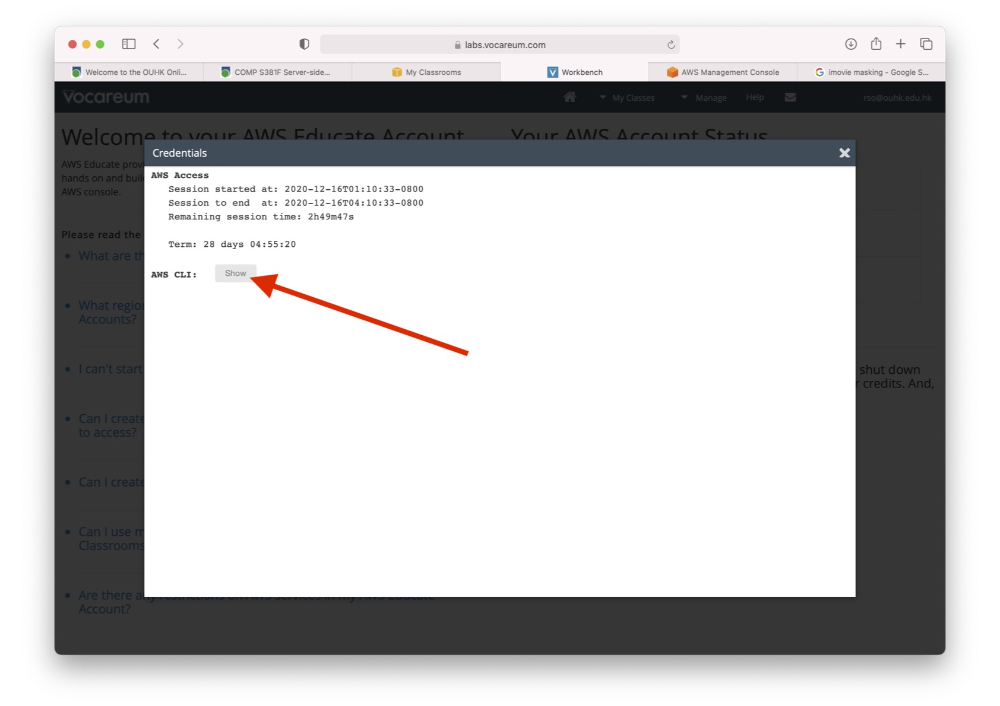
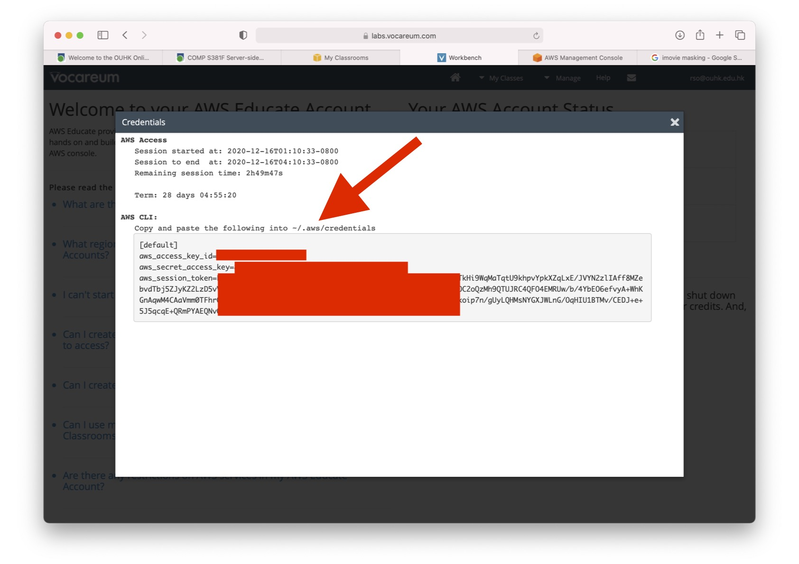

# Claudia.js
This is a step-by-step guide for creating a simple *serverless* RESTful API using **AWS Lambda** and **API Gateway**, and deploying it to AWS using [Claudia.js](https://claudiajs.com). AWS Lambda is an event-driven compute service, that executes your code in reaction to various events. API Gateway is a HTTPS end-point that can receive requests and pass them on to Lambda. In this tutorial, we’ll connect them together to execute simple requests.

The simple serverless Web API determines the *gender* (male, female or unknown) of a given first name at the following endpoint:

```
/{name}
```
## Preparation
1. Obtain your **AWS Access Key ID**, **AWS Secret Access Key** and **AWS Session Token**.



2. Add these keys to your `~/.aws/credentials` file.
```
[claudia]
aws_access_key_id = YOUR_ACCESS_KEY
aws_secret_access_key = YOUR_ACCESS_SECRET
aws_session_token = YOUR_SESSION_TOKEN
```
3. Change the access rights of `~/.aws/credentials`
```
chmod 600 ~/.aws/credentials
```
4. Set the `AWS_PORFILE` environment variable to `claudia`
```
export AWS_PROFILE=claudia
```
5. Install Claudia
```
npm install claudia -D
```
Refer to the [official preparation guide](https://claudiajs.com/tutorials/installing.html) for more details.

## Steps
Create and deploy the sample `gender` API endpoint as Lambda function
```
./node_modules/.bin/claudia create --region us-east-1 --api-module app
```
Wait for the completion of deployment.  Look for the **URL** of your Lamda function.
```
packaging files	npm install -q --no-audit --production
npm WARN gender@0.0.1 No repository field.
npm WARN gender@0.0.1 No license field.

initialising IAM role	iam.putRolePolicy	PolicyName=log-writer	RoleName
creating version alias	lambda.updateAlias	FunctionName=gender	Name=lat
creating version alias	lambda.createAlias	FunctionName=gender	Name=lat
creating REST API	apigateway.createResource	parentId=woarc1fra0	p
creating REST API	apigateway.putMethod	authorizerId=undefined	resource
creating REST API	apigateway.putIntegration	resourceId=7e0nqo	r
creating REST API	apigateway.putMethodResponse	resourceId=7e0nqo	r
creating REST API	apigateway.putIntegrationResponse	resourceId=7e0nq
creating REST API	apigateway.putMethod	resourceId=7e0nqo	restApiI
creating REST API	apigateway.putIntegration	resourceId=7e0nqo	r
creating REST API	apigateway.putMethodResponse	resourceId=7e0nqo	r
creating REST API	apigateway.putIntegrationResponse	resourceId=7e0nq
creating REST API	apigateway.putMethod	authorizerId=undefined	resource
creating REST API	apigateway.putIntegration	resourceId=woarc1fra0	r
creating REST API	apigateway.putMethodResponse	resourceId=woarc1fra0	r
creating REST API	apigateway.putIntegrationResponse	resourceId=woarc
creating REST API	apigateway.putMethod	resourceId=woarc1fra0	restApiI
creating REST API	apigateway.putIntegration	resourceId=woarc1fra0	r
creating REST API	apigateway.putMethodResponse	resourceId=woarc1fra0	r
creating REST API	apigateway.putIntegrationResponse	resourceId=woarc
creating REST API	apigateway.createDeployment	restApiId=5wjm8iz1e3	ssaving configuration
{
  "lambda": {
    "role": "gender-executor",
    "name": "gender",
    "region": "us-east-1"
  },
  "api": {
    "id": "5wjm8iz1e3",
    "id": "xxxxxxxxxx",

    "module": "app",
    "url": "https://xxxxxxxxxx.execute-api.us-east-1.amazonaws.com/latest"
  }
}
```
Upon successful deployment, write down the **URL** of the AWS API Gateway to the Lambda function.

## Run your Lambda function
```
https://xxxxxxxxxx.execute-api.us-east-1.amazonaws.com/latest/raymomnd
```
The Lambda function returns the following JSON string.
```
{"raymond":"male"}
```
## Updating your Lambda function
Use the following command to deploy a new/modified version of the Lambda function.
```
./node_modules/.bin/claudia update
```
## Destroying your Lambda function
Use the following command to remove the Lambda function.
```
./node_modules/.bin/claudia destroy
```
